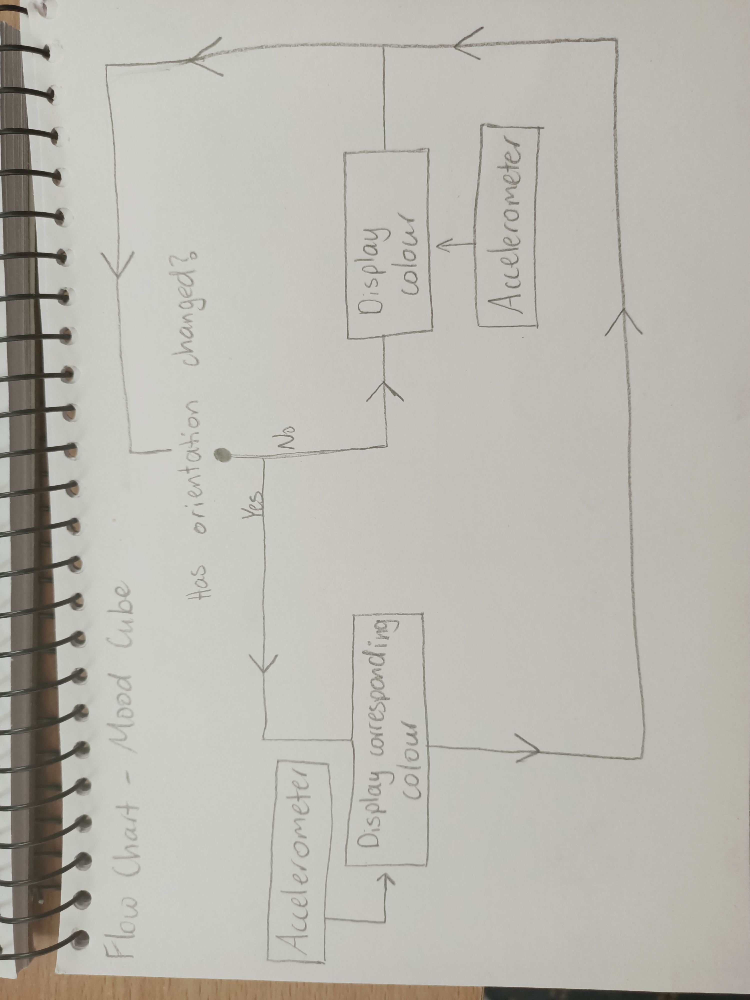

# 1701QCA Making Interaction - Assessment 2 workbook

You will use this workbook to keep track of your progress through the course and also as a process journal to document the making of your projects. The comments in italics throughout the template give suggestions about what to include. Feel free to delete those instructions when you have completed the sections.

When you have completed the template, submit the link to the GitHub Pages site for this repository as a link in Learning@Griffith. The link should be something like [https://qcainteractivemedia.github.io/1701QCA-Assessment2/](https://qcainteractivemedia.github.io/1701QCA-Assessment2/) where `qcainteractivemedia` is replaced with your GitHub username and `1701QCA-Assessment2` is replaced with whatever you called the repository this template is contained in when you set it up.

## Project working title ##
Mood Cube

## Related projects ##

### Related project 1 ###
Ever Blooming Mechanical Tulip

https://www.hackster.io/jiripraus/ever-blooming-mechanical-tulip-1b0323

This project is related to mine because of the use of light, and movement to present emotions in an interactive way. This flower includes a smaller leaf which is connected to a touch sensor. When activated, the flower will begin to bloom with the LED's shining multiple colours. 

### Related project 2 ###
Solar Powered LED Parking Sensor

https://www.hackster.io/aams86/solar-powered-led-parking-sensor-9dd11d

This project is related to mine because it uses LED's to reflect something; in this case, the proximity of a car. The mood cube uses LED's to reflect mood and an emotional state.

### Related project 3 ###
Stereo NeoPixel Ring VU Meter

https://create.arduino.cc/projecthub/ericBcreator/stereo-neopixel-ring-vu-meter-b28e78?ref=tag&ref_id=lights&offset=8

This project is related to mine because the LED's react to a change in the device. In the mood cube the change would be orientation, whereas in the uv meter, it is the dials on the back.

### Related project 4 ###
Virtual Arduino Tennis

https://create.arduino.cc/projecthub/gatoninja236/virtual-arduino-tennis-3700ce?ref=tag&ref_id=accelerometer&offset=4

This project is related to mine because it uses an accelerometer to trigger LEDs. The Arduino Tennis project has used its accelerometer to interact with a neopixel matrix in order to simulate playing tennis. My chosen project is similar because the accelerometer triggers the LEDs to change, only in a simpler way.

### Related project 5 ###
Vernal

https://create.arduino.cc/projecthub/vexelius/vernal-3c7dc0?ref=tag&ref_id=accelerometer&offset=18

This project is related to mine because the movement of the object controls the behaviour of the LEDs. This custom dress reacts to the wearer's movements by illuminating the lights that were stiched inside. My project also uses movement to light specific LEDs.

### Related project 6 ###
Gesture Control Robot

https://create.arduino.cc/projecthub/raunak-oberai/gesture-control-robot-ff1307?ref=tag&ref_id=accelerometer&offset=1

This project is related to mine because an acceleromter has been used to control another device. In this case, the orientation of the operators hand is controlling a robot whereas the mood cube uses orientation to simply switch the colour of an LED to its corresponding side.

## Other research ##

### *Brief resource name/description* ###

There were two problems that I encountered when beginning to develop my project: I had no idea how to code an accelerometer and no clue how to code an LED. Because of this, all of the research has been videos and websites that explain how these technologies work and how to program them.

https://www.youtube.com/watch?v=5M9p25OfKdg
This video source provided the basics of two types of LED and how they operated. I used this resource as a way to better understand LEDs and how they can be used

https://microbit-challenges.readthedocs.io/en/latest/tutorials/accelerometer.html
This source was by far the most helpful in understanding how an accelerometer works and how to program it. There is an enourmous amoutn of information on the measurements, how to write the measurments yourself and even some javascript gestures for more efficient coding.

https://makecode.microbit.org/reference/input/acceleration
The video on this website was a crash course in acceleration and how the accelerometer used this to calculate orientation. This was very helpful in understanding how accelerometers work in a fun way.

https://makecode.microbit.org/v0/69147-92003-84850-59500
This source was a microbit project that used the accelerometer. I looked over the code provided to understand the accelerometer better.

https://makecode.microbit.org/projects/guitar/accelerometer
This is a resource from the guitar project which includes the accelerometer. I did not learn much from this source but still wanted to reflect on it just in case there was extra information.

https://www.youtube.com/watch?v=nMxvdL9yvmo
This video source was a step-by-step tutorial of the accelerometer. This is when I learned which orientation contributed to which measurement and how to correctly adjust this to my needs for this project.

https://learn.sparkfun.com/tutorials/sparkfun-inventors-kit-for-microbit-experiment-guide/experiment-4-driving-an-rgb-led
This source was an experiement guide that used an RGB LED. The code was helpful in confirming my knowledge of how to change colours of the LED.

https://www.101computing.net/bbc-microbit-rgb-gradient/
This resource was a tutorial about achieving a gradient with an RGB LED. The information I took away from this source is that three of the four LED pins need resistors. This information of cathodes and anodes was new and, therefore, very helpful.

http://www.microbitlearning.com/code/arduino/microbit-basic-rgb-led-example.php
This resource was similar to the previous one as it provided a diagram with the pins and corresponding resistors. The set up was minutely different but the outcome seemed the same.

http://planetpixelemporium.com/tutorialpages/light.html
This website contains information about real world light sources. This source was used to find the RGB of a yellow light that would be on the base side of the cube.

https://www.w3schools.com/colors/colors_picker.asp
This source is used to find colours for html. I have utilised this source that I use for other classes to be able to pick the colours I desire on the mood cube and then copy the corresponding RGB. 

## Conceptual progress ##

### Design intent ###
A tangible object that expresses mood through orientation.

### Design concept 1 ###

A 3D hexagonal shape that changes colour depending on orientation. It would contain an accelerometer that measures changes in orientation to signify a specific colour for an LED. The purpose of this is to have a tangible object that someone can physically turn  to express their mood or emotional state.

### Design concept 2 ###

A hanging mood cube that changes colour depending on the orientation. It would contain an accelerometer that measures the change in orientation in order to display a specific colour via LED. The purpose of this object is for someone to physically see their mood and emotional state.

### Final design concept ###
*This more fully developed concept should include consideration of the interaction scheme, technical functionality, fabrication approach, materials to be used, and aesthetic.*

A mood cube that displays different colours when placed on each of its sides. It would contain an accelerometer that measures the change in orientation in order to display a specific colour via LED. The purpose of this object to provide a physical object that can be oriented in order to express mood or an emotional state.

The materials will be gold or copper wire and cardboard, creating a rustic and hipster lamp aesthetic. The cardboard will only be on the 'base' side and will have all the electricals inside while the wire will create the rest of the shape. The lightbulb and LED will be protruding from the 'base' side, coming out of the cardbord. Everything will be secured with hot glue and wire, possibly super glue if necessary.

Notes:
Afer further thought, there will be no emoticons/icons on this device. This will not suit the desired aesthetic and icreases the difficulty of the project.

### Interaction flowchart ###

## Physical experimentation documentation ##

*In this section, show your progress including whichever of the following are appropriate for your project at this point.
a.	Technical development. Could be code screenshots, pictures of electronics and hardware testing, video of tests. 
b.	Fabrication. Physical models, rough prototypes, sketches, diagrams of form, material considerations, mood boards, etc.
Ensure you include comments about the choices you've made along the way.*

*You will probably have a range of images and screenshots. Any test videos should be uploaded to YouTube or other publicly accessible site and a link provided here.*

### Technical Development ###

After researching into RBG LEDs and the accelerometer, it was time to start coding. This began with a piece of paper to help visualise the pins that would connect the microbit and LED, the orientation of the microbit and any associated mathematics, as well as the RGB of each of the colours I wanted.

### Fabrication ###

## Design process discussion ##
*Discuss your process in getting to this point, particularly with reference to aspects of the Double Diamond design methodology or other relevant design process.*

## Next steps ##
*Write a list or provide other information about your plan to move the project forward to be ready to present by video and documentation in week 12 of the course.*
